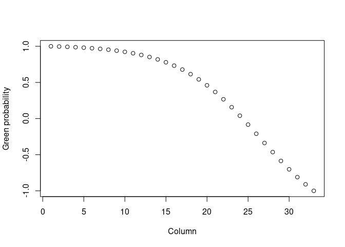
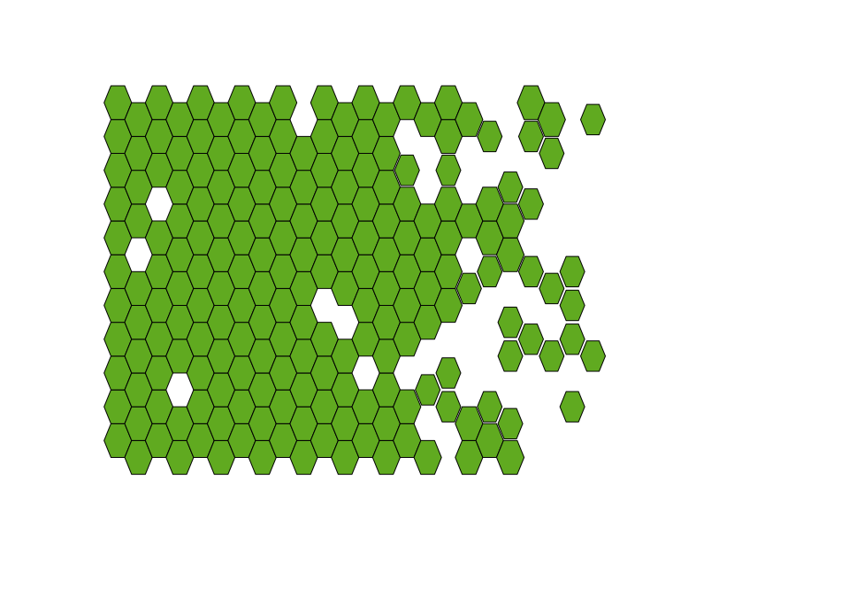
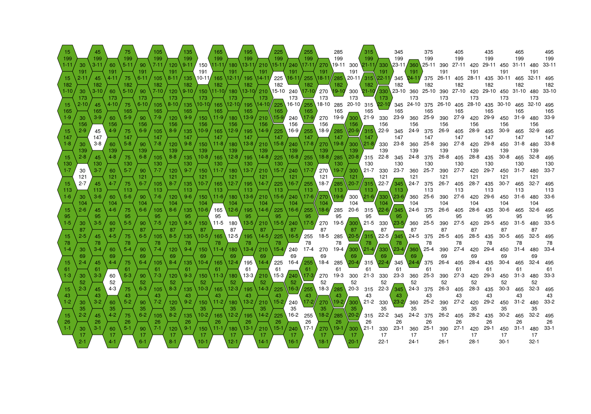

# Hexagon wall panel
Márcio Martins

# Hexagon wall panel

Everyone knows that hexagons are the bestagons. So, why not incorporate
them in your house decor?

In this project, I document the process of painting a hexagon wall
panel, from the planning to execution.

## 1. Goal

I want to paint one of my walls green, but not the entire wall. I want
it to start with solid green and then transition to white. The
transition will by having an increasing number of white hexagons, until
it transitions entirely to white.

The wall to be painted is 223 cm high and 400 cm wide. Here are the main
rules I decided on:

1.  I want to simulate panels based on a matrix of probabilities. Each
    cell will hold the probability of a hexagon being green.
2.  I want these hexagons to be 20 cm wide, but if the hexagon is in a
    border, it should be 19, to leave a gap between the isolated
    hexagons and the solid parts of the panel.

## 2. Implementation

### 2.1 If you wish to draw a hexagon grid, you must first offset their coordinates

I will not go too in depth into this section, but will instead refer you
to the [red blob games
post](https://www.redblobgames.com/grids/hexagons/) I used to create the
functions I will use. It’s a great post, and I highly recommend it.

If you wish to see the code, you can find it in the `generator.R` file.

I want the hexagon panel grids to be automatically generated. I will
create a matrix of 0s and 1s. Then, I will use this matrix to draw the
hexagons (0 = white hexagon; 1 = green hexagon).

### 2.2 Coloring probability matrix

To decide if a cell is 0 or 1, I will use random generations from from
the binomial distribution. I need to start with a matrix that holds the
probability of each cell being colored.

First, I will create a matrix to store the probability that a cell is
green. So, let’s start by deciding the size our matrix:

``` r
hex_radius <- 10
hex_gap <- 1
# Width of the wall section = 400 cm
n_col <- ceiling(500 / ((3/2 * hex_radius))) - 1
# Height of the wall section = 223 cm
n_row <- floor(223 /(sqrt(3) * hex_radius)) -1
```

So, our wall will be a `n_row` by `n_col` matrix. I want the wall to
transition from green to white, as we go from left to right. To do so,
I’ll use the **logistic function**. The logistic function is defined as:

$$f(x) = \frac{L}{1 + e^{-k(x - x_0)}}$$

Where $L$ is the maximum value, $k$ is the growth rate, and $x_0$ is the
midpoint. I will use a modified version of the logistic function, where
$L$ is 1, $k$ is negative, and $x_0$ is 80% of the panel width. This
will give me a function that starts at 1, decreases slowly, and then
decreases rapidly. We can visualize this as a function of the column
number (or the distance along the wall):

``` r
horizontal_grad <- modified_logistic(1:n_col, n_col * 0.8, -0.2)
plot(horizontal_grad, xlab = "Column", ylab = "Green probability")
```



Let’s visualize what this would look like as a wall panel:

``` r
wall <- create_matrix_binom(matrix(data = 0, nrow = n_row, ncol = n_col), horizontal_grad, gain = 0.2)

draw_panel(wall, 10)
```


It’s not bad at all! But I want to add some randomness to it. To do so,
I will use the **perlin noise** algorithm to increase the variability of
the panel. This algorithm generates a matrix of spatially correlated
random numbers. This means that the probability matrix will have some
terrain-like properties, and there will be “spots” where the probability
of coloring is higher than others.

``` r
set.seed(13)
noise <- noise_perlin(dim = c(n_row, n_col), frequency = 0.3)
image(t(noise))
```


In this image you can see lighter areas, where the probability of
coloring is higher, and darker areas, where the probability of coloring
is lower. Let’s add this to our wall panel probabilities. We’ll also use
some “gain” to increase the bias towards green. After all, this is more
art than science.

Now, let’s create the final wall panel using the sum of these two
distribution matrices. I will also use a gain to increase the bias
towards white. As for the radius of the edge hexagons, I decided that if
3 or more of the 6 neighbors of a hexagon are missing, it will be
considered an edge hexagon, with a smaller radius.

``` r
wall <- create_matrix_binom(noise, horizontal_grad, gain = 0.05)

draw_panel(wall, hex_radius = 10, missing_neighbors = 3)
```



Now we’re talking! This is a good starting point. We have some white
hexagons in the mostly solid section, and the green hexagons cluster a
little more towards the right side. This will be my final version.

## 3. Painting the wall

I added an option to my function that shows the middle coordinates of
each hexagon. This will help me set up the panel before painting it.
Let’s print the panel again, but with coordinates and increase the size
to make it easier to read:

``` r
draw_panel(wall, hex_radius = 10, coords = T, missing_neighbors = 3, cex = 0.8)
```



In this image, the coordinates show are as follows: x (center, in cm) y
(center, in cm) col number - row number

And now it’s time to paint! I used a laser cutter to create stencils to
pain, and this is the final result:


## 4. Additional functionality

### 4.1 Color by number of neighbors

I played around with the idea of coloring the hexagons based on the
number of neighbors they have. This function assigns a color to a
hexagon based on the number of missing neighbors. I didn’t want too much
color, so gave up on the functionality, but I’ll leave the code here for
future reference.

``` r
colors <- define_colors(wall, colors = c("#60AA20", "red"))

draw_panel(wall, hex_radius = 10, missing_neighbors = 3, color = colors)
```


